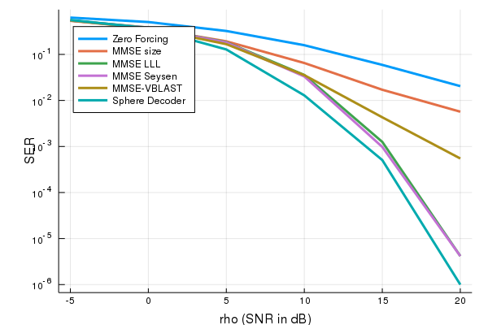

# MUMIMO

[](https://travis-ci.org/christianpeel/MUMIMO.jl)

MUMIMO is a demo package for
[LLLplus.jl](https://github.com/christianpeel/LLLplus.jl). [LLL](https://en.wikipedia.org/wiki/Lenstra%E2%80%93Lenstra%E2%80%93Lov%C3%A1sz_lattice_basis_reduction_algorithm)
and similar functions from LLLplus are used to 
simulate a multi-user multi-antenna wireless system over narrowband fading
channels, comparing the uncoded error rate for various
receivers. The receivers simulated are:
* A Zero-forcing linear receiver.
* A LLL-based receiver.
* A receiver which uses Seysen lattice reduction.
* A [V-BLAST](https://en.wikipedia.org/wiki/Bell_Laboratories_Layered_Space-Time) receiver.
* A [sphere-decoder](https://en.wikipedia.org/wiki/Lattice_problem#Sphere_decoding).

### Performance results

Before presenting performance results, we show example code to
generate the figures below.
```julia
Pkg.add("Plots")
Pkg.add("MUMIMO")
using MUMIMO
using Plots

mimoUplink(1000,4,[4],[4],[0],[12],12,[-5.0:5:20;])
mimoUplink(1000,4,[8],[8],[0],[12],12,[-5.0:5:20;])
```
The first figure shows uncoded symbol error rate (SER) vs per-user SNR
for a system in which each of 4 users transmits 4QAM symbols from a
single antenna, and a 4-antenna receive site decodes all 4 users
simultaneously. This wireless system is known by several names: the
multiple-antenna downlink channel, the multiple-user multiple-input
multiple-output (MU-MIMO) downlink, or (to information theorists) the
multiple-antenna multiple-access channel.  A training sequence of 12
samples is used to learn the channel, after which another 12 samples
are used for data transmission. Results from 10000 of these 24-sample
frames are averaged for each SER value shown in the figure.  The
sphere decoder is best, with VBLAST and the LLL receiver next, and
finally the linear receivers. No interference is present, and the
channel coefficients are independent complex Gaussian.


The second figure is the same as the first, except with eight users
transmitting, and eight receive antennas at the receive side. In this
case, there is more separation between the receivers, with the sphere
decoder and VBLAST performing the best, and the LLL receiver five dB
worse at 10% error rate, and the linear receivers about another 5
dB worse.


