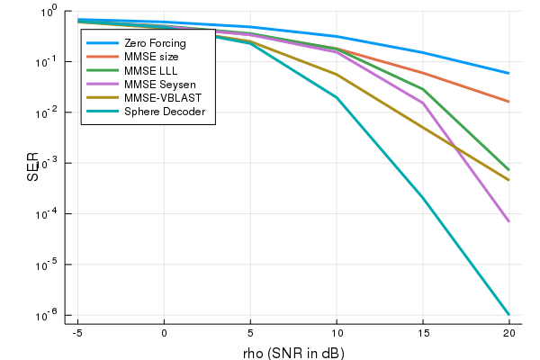
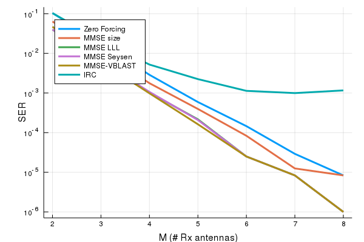

# MUMIMO

[](https://travis-ci.org/christianpeel/MUMIMO.jl)

The MUMIMO package provides functions to do simple simulation of
multi-user multi-antenna wireless simulation over narrowband fading
channels, in particular comparing the error rate for various
receivers. Among those compared linear receivers,
lattice-reduction-based receivers, VBLAST, and a sphere decoder. Here
is a list of some of the receivers simulated
* Zero-forcing linear receiver.
* A basic
  [LLL](https://en.wikipedia.org/wiki/Lenstra%E2%80%93Lenstra%E2%80%93Lov%C3%A1sz_lattice_basis_reduction_algorithm)-based
  receiver. 
* A
  [V-BLAST](https://en.wikipedia.org/wiki/Bell_Laboratories_Layered_Space-Time)
  receiver. 
* A [sphere-decoder](https://en.wikipedia.org/wiki/Lattice_problem#Sphere_decoding).
The LLL, VBLAST, and sphere-decoder receiver use tools from the
[LLLplus](https://github.com/christianpeel/LLLplus.jl) package. 

### Performance results

Before presenting performance results, we show example code to
generate the figures below.

```julia
Pkg.add("PyPlot")
Pkg.add("MUMIMO")
using MUMIMO
using PyPlot

mimoUplink(1000,4,[4],[4],[0],[12],12,[-5.0:5:20;])
mimoUplink(1000,4,[8],[8],[0],[12],12,[-5.0:5:20;])
mimoUplink(1000,4,[4],[3],[1],[12],12,[10.0;],[-15.0:5:15])
mimoUplink(1000,4,[2:8],[2],[0],[12],12,[10.0])
```
 
The first figure shows uncoded symbol error rate (SER) vs per-user SNR
for a system in which each of 4 users transmits 4QAM symbols from a
single antenna, and a 4-antenna receive site decodes all 4 users
simultaneously. A training sequence of 12 samples is used to learn the
channel, after which another 12 samples are used for data
transmission. Results from 1000 of these 24-sample frames are averaged
for each SER value shown in the figure.  The sphere decoder is best,
with VBLAST and the LLL receiver next, and finally the linear
receivers. No interference is present, and the channel coefficients
are independent complex Gaussian.


The second figure is the same as the first, except with eight users
transmitting, and eight receive antennas at the receive side. In this
case, there is more separation between the receivers, with the sphere
decoder and VBLAST performing the best, and the LLL receiver five dB
worse at the 10% error rate, and the linear receivers about another 5
dB worse.


We now consider interference-limited scenarios; in the following
figure the SER is shown as a function of carrier-to-interference ratio
(CIR) in dB, with the 'carrier' (or desired user) maintained at 10
dB. The only receiver which is designed to handle interference is the
IRC receiver, which indeed does the best in this scenario in which
three desired users transmit to the base-station, while one
interferer also transmits.


Finally, we show SER as a function of the number of receive antennas,
with the SNR fixed to 10 dB, two users transmitting, no interference,
12 training samples, and 12 data samples as before. More antennas
gives an advantage.


### Adding receivers

This list of receivers and description above are in no way complete;
we'd love your help! Straightforward receivers which are not included in the
figures above which you might add include:
* A whitened sphere decoder
* Add a SIC to a lattice-reduction receiver.
* Add other lattice-reduction techniques.

This module was written by
[Chris Peel](https://github.com/ChristianPeel).

